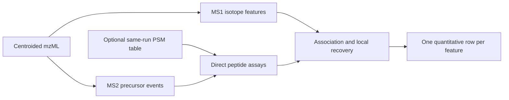

# Getting started

## What Biosaur2 measures

An LC-MS instrument repeatedly observes ions as they leave a chromatography
column.

- **MS1 scan:** a survey of intact ions. Biosaur2 measures abundance here.
- **MS2 event:** fragmentation of a selected precursor. Its precursor metadata
  helps locate a feature; fragment intensity is not used as feature abundance.
- **m/z:** mass divided by charge.
- **Retention time (RT):** when a signal appears during chromatography.
- **Isotope envelope:** related peaks caused by natural isotopes of one ion.
- **Feature:** an isotope envelope followed across several MS1 scans.
- **PSM:** a peptide-spectrum match from a search engine, usually one proposed
  peptide for one MS2 spectrum.



Use default `legacy` mode for strict, untargeted LC-MS1 detection. Use
`--feature-mode hybrid` for DDA data when you want MS2-aware association,
target/decoy confidence control, local recovery, and named quantification.

## First commands

Legacy defaults to one TSV:

```bash
biosaur2 sample.mzML.gz
```

Hybrid defaults to three Parquet files:

```bash
biosaur2 sample.mzML.gz --feature-mode hybrid --workers 4
```

The files are `sample.features.parquet`, `sample.ms2_events.parquet`, and
`sample.identifications.parquet`. The features table is the main quantitative
result; `ms2_events.feature_idx` links spectra to it. See
[Outputs and quantification](outputs-and-quantification.md).

## PSM input

`--psm-path` accepts a Percolator target PSM TSV from the same mzML run. It may
also be compressed. Common accepted headers include a spectrum identifier,
peptide, q-value, PEP, score and charge. A minimal illustrative file is:

```tsv
PSMId	peptide	q-value	posterior_error_prob	score	charge
sample_1542_2_1	K.PEPTIDEK.R	0.0021	0.0014	8.73	2
sample_1601_3_1	R.ACDEFGHIK.K	0.0068	0.0041	7.92	3
```

The spectrum identifier must map to an MS2 spectrum in the same mzML. Header
spelling varies among Percolator pipelines; Biosaur2 recognizes its supported
aliases and reports a clear error for missing required fields.

The peptide column contains the peptide assigned to the spectrum. Flanking
residues such as `K.PEPTIDEK.R` are allowed. Modifications should be explicit,
preferably as Unimod identifiers, for example:

```text
K.AC[UNIMOD:4]DEFGHIK.R
M[UNIMOD:35]PEPTIDE
n[UNIMOD:1]PEPTIDEK
```

A fixed modification normally is not repeated in every peptide string. Tell
Biosaur2 about it with a repeatable `--fixed-mod SITE=MOD` option:

```bash
--fixed-mod C=UNIMOD:4
--fixed-mod peptide_n_term=UNIMOD:1
--fixed-mod K=UNIMOD:259
```

Do not declare a variable modification as fixed. Biosaur2 does not guess fixed
chemistry because the exact formula and isotope envelope depend on it.

## Confidence in plain language

A **target** is the real precursor hypothesis. A **decoy** is an intentionally
incorrect shifted hypothesis evaluated by the same rules. Target and decoy
wins estimate how many accepted associations may be false.

A **q-value** is an estimated false-discovery rate among accepted results at
least as strong as that row. A threshold of 0.01 means an estimated rate near
or below 1% for the accepted group. It is not a 99% probability for every
individual row.

Percolator PSM q-values and Biosaur2 generic extraction q-values answer
different questions. Read [Hybrid workflow](hybrid-workflow.md) before
changing either threshold.

## Several comparable files

Project mode aligns runs from their final strong features. A strong feature in
another compatible run may support a weak isotope-envelope candidate already
measured in the target run. It does not transfer peptide identity or source-run
intensity, and the Project stage does not reopen mzML for targeted extraction.

```bash
biosaur2 project run --manifest runs.tsv --output-dir results \
  --project-db results/project.duckdb --mode hybrid --workers 16
```

Continue with [Project workflow](project-workflow.md).
