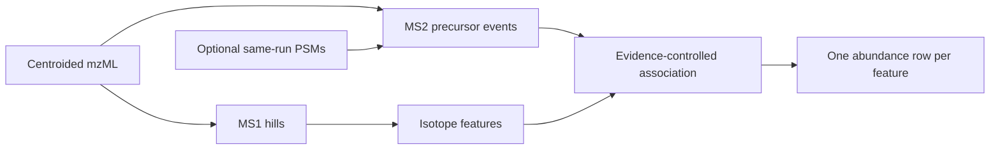

# Getting started

## What Biosaur2 measures

In liquid chromatography-mass spectrometry (LC-MS), molecules leave the
chromatography column at different times. The mass spectrometer repeatedly
measures ions during that time.

- **MS1 scan:** a survey measurement of intact ions. Its signal is used for
  feature detection and abundance.
- **MS2 event:** fragmentation of a selected precursor ion. It can help
  identify a peptide, but its fragment signal is not copied into MS1
  abundance.
- **m/z:** mass divided by charge, the horizontal coordinate in a mass
  spectrum.
- **Retention time (RT):** when a signal appears during chromatography.
- **Isotope envelope:** the related peaks produced by natural isotopes of one
  molecule.
- **Feature:** an isotope envelope followed across several MS1 scans. One
  accepted feature receives one abundance row.
- **PSM:** a peptide-spectrum match, meaning a search engine assigned a peptide
  sequence to an MS2 spectrum.



## Which mode should I use?

Use the default `legacy` mode when you want the established strict, untargeted
MS1 detector and do not need MS2-to-feature audit information.

Use `--feature-mode hybrid` for DDA data when you want MS2-aware association,
local recovery, target/decoy confidence control, and the quantification
sidecars. A PSM table improves direct peptide-specific assays but is optional.

Use `biosaur2 project run --mode hybrid` for several comparable runs when you
also need retention-time alignment and recipient-run extraction.

## First hybrid command

```bash
biosaur2 sample.mzML.gz \
  --feature-mode hybrid \
  --feature-format parquet \
  --workers 4
```

This writes the ordinary feature table plus the hybrid sidecars described in
[Outputs and quantification](outputs-and-quantification.md).

## Confidence words

A **target** is a real precursor hypothesis. A **decoy** is an intentionally
incorrect hypothesis processed by the same rules. Target and decoy outcomes
are compared to estimate how many accepted target associations may be false.

A **q-value** is the estimated false-discovery rate among results at least as
strong as a candidate. A threshold of `0.01` means an estimated rate of no more
than about 1%, not a 99% probability that every individual row is correct.

Read [Hybrid workflow](hybrid-workflow.md) before changing confidence
thresholds.
