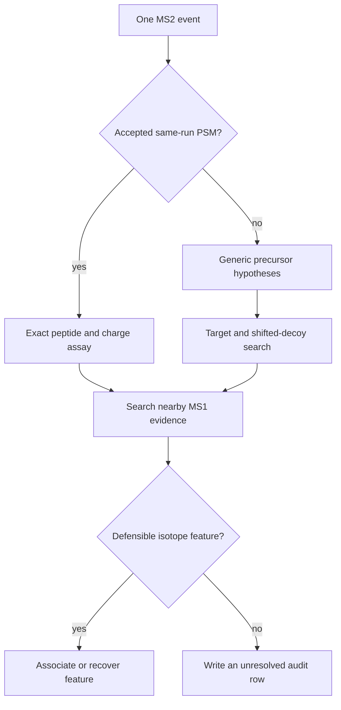

# Hybrid workflow

Hybrid mode begins with the complete strict MS1 feature population. It then
uses MS2 evidence to associate existing features or recover local features
from unassigned MS1 intensity. Features without MS2 support do not receive
relaxed acceptance rules.

## Same-run evidence

Direct evidence comes from a Percolator PSM produced for the same mzML run.
The peptide sequence, charge, expected isotopes, and MS2 time define a specific
assay. Biosaur2 first tries to associate it with an existing strict feature;
if necessary, it examines nearby residual MS1 signal.

Generic evidence is used when no accepted peptide assay is available. Biosaur2
tests bounded charge and carbon-isotope-error hypotheses derived from the MS2
precursor metadata.

`--ms2-rt-tolerance-sec 120` means the initial search can inspect MS1 evidence
up to 120 seconds before or after that MS2 event **in the same run**. Calibration
may tighten a retry. This parameter does not align or match different runs.

## Generic target/decoy q-value

For an unidentified MS2 event, Biosaur2 constructs a real target precursor
hypothesis and a deliberately shifted false hypothesis. Both are searched
with the same local MS1 rules. Across events, target wins and decoy wins
estimate how often generic associations may be false.

`--generic-q-value-max 0.01` retains generic associations at an estimated
false-discovery rate of at most about 1%. This is not the same quantity as
`--psm-q-value-max`:

| Parameter | What it filters |
| --- | --- |
| `--psm-q-value-max` | Peptide-spectrum identifications supplied by Percolator. |
| `--generic-q-value-max` | Generic MS2-to-MS1 extraction associations made by Biosaur2. |
| `--external-q-value-max` | Cross-run recipient extractions in project mode. |

Passing one threshold does not imply passing another.

## Local recovery

Local recovery does not invent intensity and does not force every MS2 event to
have a feature. It searches raw MS1 centroids near the event's m/z and RT,
checks chromatographic continuity and isotope agreement, and uses only
currently unowned residual intensity. A successful candidate becomes one
feature; an insufficient or ambiguous candidate remains an explicit null
outcome in the audit table.

`--relaxed-ms2-feature` enables one guarded retry for unresolved MS2-supported
evidence. It is not a global sensitivity switch and should be evaluated on a
controlled dataset before routine use.

For scoring, ownership, and competition details, read [the design](../design.md).
