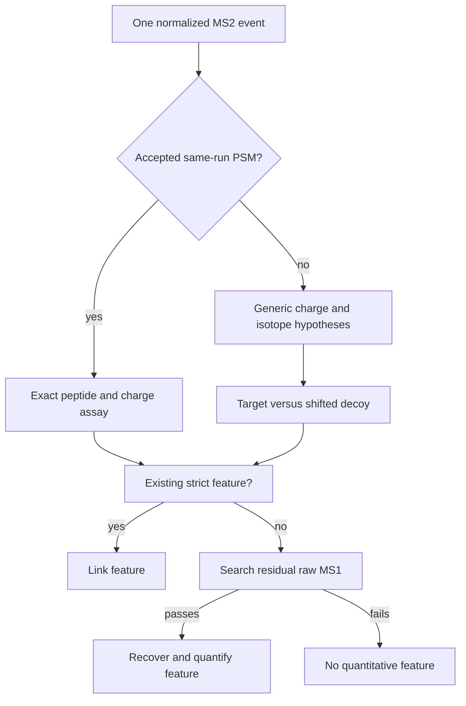

# Hybrid workflow

Hybrid mode starts with the complete strict MS1 feature population. It then
uses DDA MS2 evidence to associate existing features or recover local features
from still-unowned MS1 signal. Features with no MS2 support keep the strict
acceptance rules.

## Same-run evidence

Direct evidence comes from a Percolator PSM for the same mzML. Its peptide,
charge, expected isotope envelope and MS2 time form a specific assay.
Biosaur2 first tries an existing strict feature and then, if needed, searches
nearby residual MS1 centroids.

Generic evidence is used when an MS2 event has no accepted direct assay.
Biosaur2 tests bounded charge and selected-isotope hypotheses from the
precursor metadata. The default isotope errors are `0,1,2,3`, meaning the
selected peak may be M through M+3:

```text
monoisotopic m/z = selected-ion m/z - isotope_error * 1.003354835 / charge
```

`--ms2-rt-tolerance-sec 120` searches up to 120 seconds before and after that
MS2 event in the same run. It is unrelated to cross-run retention-time
alignment.



## What target/decoy controls

For unidentified MS2, the target is the real precursor hypothesis. A decoy is
a deterministic, deliberately shifted false precursor processed with the same
association and extraction rules. Target and decoy wins across events estimate
how often accepted generic associations may be false.

`--generic-q-value-max 0.01` keeps generic associations at an estimated
false-discovery rate no greater than about 1%. It is not the Percolator PSM
q-value:

| Threshold | Question |
| --- | --- |
| `--psm-q-value-max` | Is the supplied peptide-spectrum assignment reliable enough to build a direct assay? |
| `--generic-q-value-max` | Does an unidentified-MS2 precursor associate with MS1 evidence more convincingly than shifted decoys? |
| `--external-q-value-max` | Does a weak recipient feature have stronger summed cross-run support than its shifted project-level decoy? |

Passing one threshold does not imply passing another.

## Local recovery

Local recovery does not invent intensity or force every MS2 event to have a
feature. It searches raw MS1 centroids near the event's m/z and RT, checks
chromatographic continuity and isotope agreement, and allocates only residual
intensity not already owned by another feature.

The default width limit is adaptive. `--generic-local-max-width-sec auto` uses
the strict-feature width q99, clamps it to 15-60 seconds, and falls back to 30
seconds when no strict widths exist. It rejects overly broad recovered
components; it does not change `--ms2-rt-tolerance-sec`. All generic recovery
thresholds and defaults are listed in [Parameter guide](parameters.md).

`--relaxed-ms2-feature` enables one guarded retry with fewer required MS1
points but a higher isotope-similarity default. Direct retries still require a
high-confidence same-run PSM; generic retries retain paired target/decoy
control.

## What is retained

The Hybrid features table embeds zero, one or multiple linked MS2 records in
each feature's `ms2_events` list. The identifications table retains accepted
PSM rows, including PSM-bearing events that did not obtain a feature. An MS2
event with neither a feature nor a PSM is intentionally omitted row-by-row;
summary metadata and logs still report aggregate outcomes.

This keeps the main output focused on quantitative features while preserving
identification-bearing failures that a user may need to inspect. See
[Outputs and quantification](outputs-and-quantification.md) and
[the design](../design.md).
