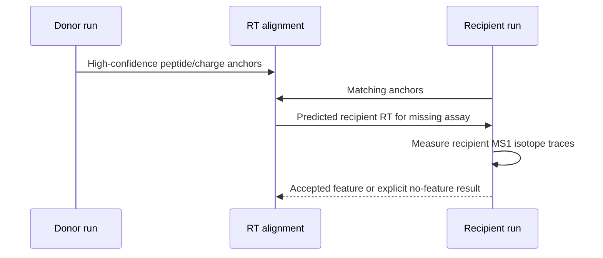

# Project workflow

Project mode processes a manifest of runs, records status in DuckDB, and can
use identifications shared across comparable runs to guide missing-feature
extraction.

## Manifest

Only `run_id` and `mzml_path` are required:

```tsv
run_id	mzml_path
run_a	mzml/run_a.mzML.gz
run_b	mzml/run_b.mzML.gz
```

For identification-aware alignment, add `psm_path` and `alignment_group`:

```tsv
run_id	mzml_path	psm_path	alignment_group
run_a	mzml/run_a.mzML.gz	psm/run_a.psms.tsv	batch_1
run_b	mzml/run_b.mzML.gz	psm/run_b.psms.tsv	batch_1
```

Only put runs in the same alignment group when they are scientifically
comparable. See [`examples/hybrid_project_manifest.tsv`](../examples/hybrid_project_manifest.tsv)
for additional metadata columns.

## Cross-run matching

Cross-run matching is different from the same-run
`--ms2-rt-tolerance-sec` search:

| Same-run local search | Cross-run project matching |
| --- | --- |
| Centers on an MS2 event in one mzML file. | Uses shared peptide/charge anchors between runs. |
| Searches nearby raw MS1 scans directly. | Fits a robust RT mapping inside an alignment group. |
| Controlled by `--ms2-rt-tolerance-sec`. | Controlled by anchor count, alignment MAD, and external extraction settings. |



Donor abundance is never copied. The donor identification guides where to
look, while the final intensity is measured from the recipient's own MS1 data.

## Run a project

```bash
biosaur2 project run \
  --manifest runs.tsv \
  --output-dir results \
  --project-db results/project.duckdb \
  --mode hybrid \
  --workers 16

biosaur2 project validate --project-db results/project.duckdb
```

`--workers` is the total CPU budget across active runs. Biosaur2 chooses the
run concurrency and per-run allocation automatically.

## Reuse project caches

The first command retains raw MS1, strict-stage, and candidate caches under one
root:

```bash
biosaur2 project run \
  --manifest runs.tsv \
  --output-dir results \
  --project-db results/project.duckdb \
  --mode hybrid \
  --cache-dir project-cache --keep-cache \
  --workers 16
```

Run the project again with the same cache root. Use `--overwrite` when the
existing outputs should be regenerated, or `--resume` when valid completed
runs should be skipped:

```bash
biosaur2 project run \
  --manifest runs.tsv \
  --output-dir results \
  --project-db results/project.duckdb \
  --mode hybrid \
  --cache-dir project-cache --keep-cache \
  --workers 16 --overwrite
```

Cache manifests are checked against the source and relevant scientific state.
Compatible upstream layers are reused; a changed downstream option does not
unnecessarily invalidate raw ingestion, while incompatible layers are
recomputed. Without `--keep-cache`, the command removes its private temporary
cache namespace after the project and external-alignment stages finish.
