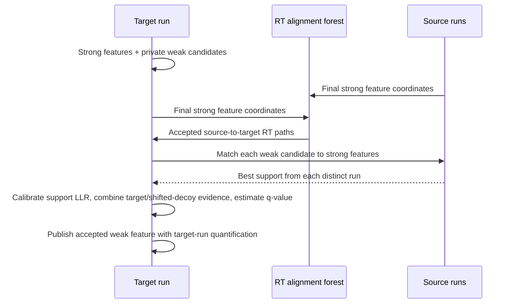

# Project workflow

Project mode runs multiple mzML files under one adaptive CPU and memory budget
and records run, alignment, rescue and validation status in a Project DuckDB.
In Hybrid mode, comparable runs can support weak features that were already
observed locally but did not pass ordinary strong-feature selection.

## Manifest

Only `run_id` and `mzml_path` are required:

```tsv
run_id	mzml_path
run_a	mzML/run_a.mzML.gz
run_b	mzML/run_b.mzML.gz
```

PSM paths are optional. Add an alignment group when a manifest contains
scientifically distinct fractions, batches or conditions:

```tsv
run_id	mzml_path	psm_path	alignment_group
run_a	mzML/run_a.mzML.gz	psm/run_a.psms.tsv	batch_1
run_b	mzML/run_b.mzML.gz	psm/run_b.psms.tsv	batch_1
run_c	mzML/run_c.mzML.gz		batch_2
```

Only runs in the same alignment group may support one another. PSMs still
control same-run direct Hybrid assays, but external RT alignment and rescue use
features only and work for runs without PSM files. The manifest may override
`q_value_max` and `fixed_mods` per run and retain sample, fraction and batch
metadata. See
[`examples/hybrid_project_manifest.tsv`](../examples/hybrid_project_manifest.tsv).

## Local and cross-run stages

| Local Hybrid stage | Project external stage |
| --- | --- |
| Detects and quantifies final strong features in each mzML. | Aligns final strong features between comparable runs. |
| With `--external-id`, screens rejected envelopes into a private weak sidecar. | Matches those existing weak candidates against strong features in other runs. |
| Weak gates cover points, isotope cosine, positive quantification, strong equivalence and same-run ownership overlap. | Requires charge/FAIMS identity, ppm and aligned-RT agreement, then applies target/decoy transfer FDR. |
| Does not publish weak sidecar rows as features. | Publishes only accepted weak rows; it never performs donor-guided raw extraction. |



The source run never supplies abundance. The weak candidate's boundaries and
quantification were measured in the target mzML during local processing.
Cross-run evidence only supports whether that existing weak signal is likely
real. Rescued features are written with feature origin
`aligned_external_weak` and confidence tier `external_id_weak`; they are not
fed back into the strong support index during the same Project run.

RT anchors are mutual-nearest strong features with equal charge and FAIMS.
After 8 ppm matching, a longest increasing RT chain removes crossing matches.
Held-out anchors validate bias, MAD and q90 before an alignment edge is used.
Accepted bidirectional edges form reference-rooted forest components. Each
source run contributes at most one best strong match to a weak candidate;
empirical log-likelihood evidence from up to four distinct source runs is
combined by default. One source run is sufficient for eligibility, but
multi-run evidence receives a much larger calibrated score. Target and
shifted-decoy sides use identical rules.

See [Parameter guide](parameters.md#external-weak-feature-rescue-help-all)
for the exact gate definitions, defaults and tuning consequences.

## Run a project

```bash
biosaur2 project run \
  --manifest runs.tsv \
  --output-dir results \
  --project-db results/project.duckdb \
  --mode hybrid \
  --format parquet \
  --workers 16

biosaur2 project validate --project-db results/project.duckdb
```

External-ID is enabled by default for Hybrid projects. Use
`--no-external-id` to avoid both local weak-candidate generation and the
cross-run stage. A single-file Hybrid command may create private sidecars for
later Project use, but cannot rescue candidates by itself.

`--workers` is the Project manager's busy-core target. It starts with
multi-worker runs, adds lower-allocation runs while sampled CPU is below target,
and admits work only while the configured physical-memory budget permits.
`--max-memory` is an integer GiB admission cap; swap is excluded.

For Parquet or TSV, every run directory contains its own `features`,
`identifications` and Project external evidence files. With
`--format duckdb`, each run receives one `<run_id>.biosaur2.duckdb` with
`features`, `identifications`, `runs` and, after Project rescue,
`external_id_evidence`. The separate `project.duckdb` indexes run status,
resolved options, RT models, funnel summaries and output paths.

## Resume and caches

Project resume is enabled by default. A completed local run is reused only when
its input fingerprint, scientific command and local option signature still
match. Weak point, cosine or overlap changes are local changes, so they rebuild
the weak sidecar. External q-value, alignment or support-run changes do not
invalidate local output; they rerun the Project in-memory alignment and
competition from compatible strong/weak sidecars.

```bash
biosaur2 project run --manifest runs.tsv --output-dir results \
  --project-db results/project.duckdb --mode hybrid --workers 16 \
  --cache-dir project-cache --keep-cache
```

`--keep-cache` retains fingerprinted raw MS1, strict-stage, candidate and
external strong/weak sidecars for later reuse. Without it, an interrupted
Project keeps its deterministic private workspace for resume, while completed
local raw/strict/candidate layers are removed after their sidecars and outputs
are safely published. A fully successful Project removes the remaining private
workspace. There is no recipient raw-ownership cache and no separate
external-recipient checkpoint: feature-MBR competition is deterministic and is
rerun from the compact sidecars.

Use `--no-resume --overwrite` for a deliberate fresh replacement run. Cache
manifests fingerprint source and relevant scientific state; incompatible or
partially published layers are rejected rather than silently reused.

Advanced external controls appear under
`biosaur2 project run --help-all`. Change them only after inspecting alignment
and rescue funnel statistics on representative data.
