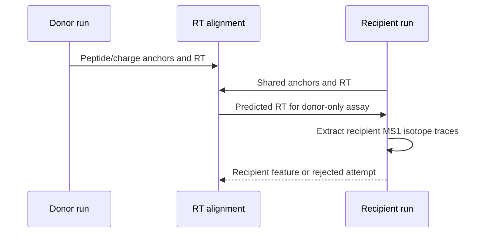

# Project workflow

Project mode runs several files under one CPU/cache budget and records status
in a project DuckDB. In Hybrid mode, comparable runs can assist one another:
shared high-confidence peptide/charge observations align retention time, then
a missing assay can be searched in the recipient run.

## Manifest

Only `run_id` and `mzml_path` are required:

```tsv
run_id	mzml_path
run_a	mzml/run_a.mzML.gz
run_b	mzml/run_b.mzML.gz
```

Add same-run PSM files and an alignment group for identification-aware work:

```tsv
run_id	mzml_path	psm_path	alignment_group
run_a	mzml/run_a.mzML.gz	psm/run_a.psms.tsv	batch_1
run_b	mzml/run_b.mzML.gz	psm/run_b.psms.tsv	batch_1
run_c	mzml/run_c.mzML.gz	psm/run_c.psms.tsv	batch_2
```

Only place scientifically comparable runs in one alignment group. In this
example, runs A and B can assist one another; run C cannot donate to them. The
manifest may also override `q_value_max` and `fixed_mods` per run and retain
sample/fraction/batch metadata. See
[`examples/hybrid_project_manifest.tsv`](../examples/hybrid_project_manifest.tsv).

## Same-run versus cross-run

| Same-run local search | Cross-run project assistance |
| --- | --- |
| Starts from one MS2 event in one mzML. | Starts from a peptide/charge observed in another comparable run. |
| Searches nearby MS1 scans directly. | Fits a robust RT mapping from shared direct-identification anchors. |
| Uses `--ms2-rt-tolerance-sec`. | Uses alignment anchor/MAD and external-extraction controls. |
| May run without PSMs through generic evidence. | Requires donor identifications and a valid alignment. |



Donor abundance is never copied. The donor says what ion to look for and the
alignment says approximately when; the final signal is measured from the
recipient mzML and competes with a recipient-run decoy.

## Feature-only external weak rescue

Hybrid runs with external-ID enabled retain detector rejects as private weak
candidates. The default local gates require at least two monoisotopic points,
two points in a secondary isotope, isotope cosine at least 0.6, positive
quantification, and no equivalent same-run strong feature. Candidates with
more than `--external-weak-max-strong-overlap` (0.30 by default) of their raw
hill intensity already owned by final same-run strong features are rejected.

The Project stage aligns strong features between runs and matches each weak
candidate using exact charge and FAIMS, 8 ppm m/z tolerance, and the configured
RT window. Each source run contributes at most its best feature. By default at
least one distinct source run is required, and scores from at most four source
runs are summed; configure these bounds with
`--external-min-support-runs` and `--external-max-support-runs`. Target and
shifted-decoy supports use identical rules, and
`--external-q-value-max` defaults to 0.10.

Only weak candidates accepted by this project-level competition are published
as `aligned_external_weak` / `external_id_weak` features. Donor abundance is
never copied, and rescued weak features are not promoted into the strong donor
index.

## Run a project

```bash
biosaur2 project run \
  --manifest runs.tsv \
  --output-dir results \
  --project-db results/project.duckdb \
  --mode hybrid \
  --format parquet \
  --workers 16

biosaur2 project validate --project-db results/project.duckdb
```

`--workers` is the Project manager's target number of busy CPU cores. It starts
with four-worker runs, then adds one-worker runs only while measured project
CPU remains below target and memory is available. Declared allocations are
bounded at 1.5 times the target, so phase overlap is controlled rather than
unbounded. `--max-memory` is an integer GiB admission cap (default: physical
RAM/cgroup limit; swap is excluded).

For Parquet or TSV, every run directory contains its own `features` and
`identifications` files. A single-file Hybrid command stops there. A successful
Hybrid project also runs cross-run external-ID processing by default and writes
one `external_id_evidence` file per run; use `--no-external-id` to disable that
stage. With `--format duckdb`, every run instead receives one
`<run_id>.biosaur2.duckdb` containing `features`, `identifications`, `runs` and,
after cross-run processing, `external_id_evidence`. The separate
`project.duckdb` is an index and status database, not a replacement for those
per-run outputs.

## Reuse project caches

Retain all cache layers under one root on the first run:

```bash
biosaur2 project run --manifest runs.tsv --output-dir results \
  --project-db results/project.duckdb --mode hybrid --workers 16 \
  --cache-dir project-cache --keep-cache
```

Re-run with the same cache root and a new output location:

```bash
biosaur2 project run --manifest runs.tsv --output-dir results-recheck \
  --project-db results-recheck/project.duckdb --mode hybrid --workers 16 \
  --cache-dir project-cache --keep-cache
```

Project resume is on by default. Reusing the original locations skips completed
local runs and external recipients only when their inputs, scientific options,
exact donor/alignment plan and published outputs still match. A changed plan
recomputes only affected recipients. If a required recipient cache was cleaned
after a prior success, Project automatically refreshes that recipient's local
stage before external recovery; use `--no-resume --overwrite` for a fresh
replacement run.

Cache manifests fingerprint the source and relevant scientific state. A
downstream option change does not invalidate raw ingestion unnecessarily;
incompatible or partially published layers are recomputed. Without
`--keep-cache`, an interrupted Project retains its deterministic private
workspace for resume. After each checkpoint, strict/candidate layers are
removed once external-ID no longer needs them; raw/ownership layers are removed
after the recipient succeeds. The remaining workspace is removed after a fully
successful Project. `--keep-cache` preserves all compatible layers.

`--max-memory` is an admission limit in GiB and excludes swap. The Project
manager samples `MemAvailable` before launching its first run and waits when
free memory is temporarily insufficient. It fails immediately only when the
configured limit cannot admit even one conservatively estimated run.

Advanced alignment and external-extraction tolerances appear under
`biosaur2 project run --help-all`. Keep defaults unless a representative
validation set supports a change.
