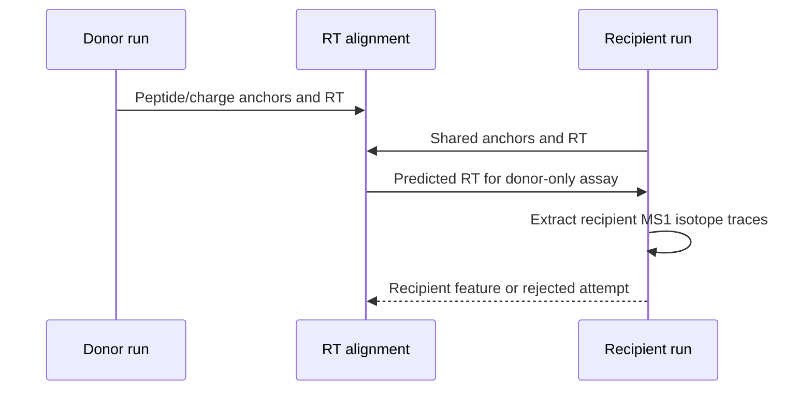

# Project workflow

Project mode runs several files under one CPU/cache budget and records status
in a project DuckDB. In Hybrid mode, comparable runs can assist one another:
shared high-confidence peptide/charge observations align retention time, then
a missing assay can be searched in the recipient run.

## Manifest

Only `run_id` and `mzml_path` are required:

```tsv
run_id	mzml_path
run_a	mzml/run_a.mzML.gz
run_b	mzml/run_b.mzML.gz
```

Add same-run PSM files and an alignment group for identification-aware work:

```tsv
run_id	mzml_path	psm_path	alignment_group
run_a	mzml/run_a.mzML.gz	psm/run_a.psms.tsv	batch_1
run_b	mzml/run_b.mzML.gz	psm/run_b.psms.tsv	batch_1
run_c	mzml/run_c.mzML.gz	psm/run_c.psms.tsv	batch_2
```

Only place scientifically comparable runs in one alignment group. In this
example, runs A and B can assist one another; run C cannot donate to them. The
manifest may also override `q_value_max` and `fixed_mods` per run and retain
sample/fraction/batch metadata. See
[`examples/hybrid_project_manifest.tsv`](../examples/hybrid_project_manifest.tsv).

## Same-run versus cross-run

| Same-run local search | Cross-run project assistance |
| --- | --- |
| Starts from one MS2 event in one mzML. | Starts from a peptide/charge observed in another comparable run. |
| Searches nearby MS1 scans directly. | Fits a robust RT mapping from shared direct-identification anchors. |
| Uses `--ms2-rt-tolerance-sec`. | Uses alignment anchor/MAD and external-extraction controls. |
| May run without PSMs through generic evidence. | Requires donor identifications and a valid alignment. |



Donor abundance is never copied. The donor says what ion to look for and the
alignment says approximately when; the final signal is measured from the
recipient mzML and competes with a recipient-run decoy.

## Run a project

```bash
biosaur2 project run \
  --manifest runs.tsv \
  --output-dir results \
  --project-db results/project.duckdb \
  --mode hybrid \
  --format parquet \
  --workers 16

biosaur2 project validate --project-db results/project.duckdb
```

`--workers` is the total CPU budget. Biosaur2 dynamically chooses active files
and the per-file allocation without exceeding it.

For Parquet or TSV, every run directory contains its own `features` and
`identifications` files. Hybrid projects may add an
`external_id_evidence` file. With `--format duckdb`, every run instead receives
one `<run_id>.biosaur2.duckdb` containing `features`, `identifications`, `runs`
and, after cross-run processing, `external_id_evidence`. The separate
`project.duckdb` is an index and status database, not a replacement for those
per-run outputs.

## Reuse project caches

Retain all cache layers under one root on the first run:

```bash
biosaur2 project run --manifest runs.tsv --output-dir results \
  --project-db results/project.duckdb --mode hybrid --workers 16 \
  --cache-dir project-cache --keep-cache
```

Re-run with the same cache root and a new output location:

```bash
biosaur2 project run --manifest runs.tsv --output-dir results-recheck \
  --project-db results-recheck/project.duckdb --mode hybrid --workers 16 \
  --cache-dir project-cache --keep-cache
```

Alternatively, use the original locations with `--resume` to skip completed
runs whose inputs and scientific option signatures still match, or
`--overwrite` to regenerate their outputs while reusing compatible caches.

Cache manifests fingerprint the source and relevant scientific state. A
downstream option change does not invalidate raw ingestion unnecessarily;
incompatible or partially published layers are recomputed. Without
`--keep-cache`, the job's private cache namespace is removed only after both
per-run and cross-run stages finish.

Advanced alignment and external-extraction tolerances appear under
`biosaur2 project run --help-all`. Keep defaults unless a representative
validation set supports a change.
